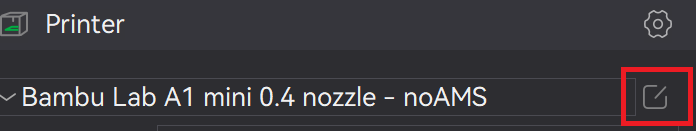
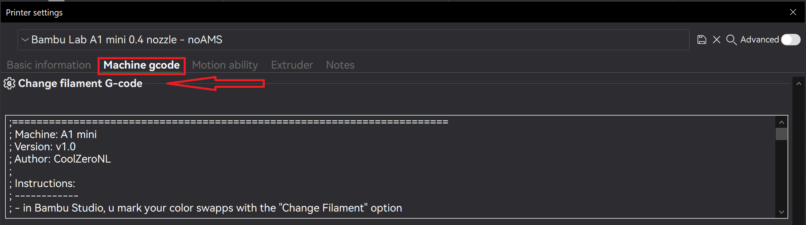

# Custom G-Code for Bambu Studio | A1 Mini 

Repository for custom g-code for Bambu Studio. It also contains original g-code for reference - in the case that the code needs to be reverted to the stock, check Bambu Studio's repository for the latest available g-code.

Custom g-code to change the filament on a BambuLab A1 Mini printer without an AMS. This makes it so changing filament in the slicer (instead of just pausing) will cut & unload the filament and then pause. Previously, the g-code for changing filament would be ignored if there was no AMS and would continue the print.

I couldn't find the actual g-code to cut the filament and unload the filament anywhere, so I just added G1 codes to try to mimic the motion that occurs when pressing the unload filament button. I also added the code to extrude forward a bit, and then back it out. 

Use at your own risk!

# Installation Instructions

Find the "Change filament G-code" section. To get here, click the edit button here:

Click the "Machine G-Code tab", and then scroll down to the section "Change filament G-code". 

# Usage Instructions

Slice and print as normal assign colors trough on right slider Change Filament.

During the filament change, the filament will be unloaded. Once the filament is unloaded, remove the filament and insert the new filament. 

Make sure that the filament will be pulled in by the extruder gears and purge the new filament. This can be done trough the "load" button, or by manual extruding. When the new filament is loaded, press resuming. 
